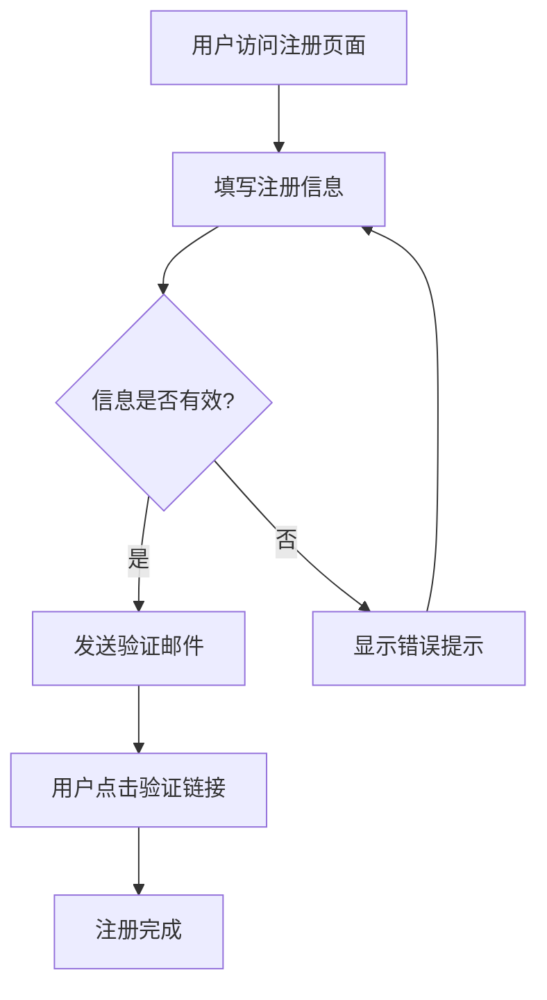

# 单元 2：项目、Artifacts 与 Skills

[← 上一课：Claude 的工作原理](./01-how-claude-works.md) | [返回目录](./README.md) | [下一课：提示词技巧 →](./03-prompting-techniques.md)

---

## 概述

Claude.ai 不仅仅是一个简单的聊天窗口。它提供了三个强大的功能来帮助你更好地组织工作和提升效率：

- **Projects**（项目）：将相关对话、知识和指令组织在一起
- **Artifacts**（成果物）：Claude 生成的独立内容，如代码、文档、图表
- **Skills**（技能）：可复用的提示词模板，让 Claude 自动执行特定任务

---

## Projects（项目）

### 什么是 Projects？

Projects 是 Claude.ai 中用来组织对话的功能。你可以把它想象成一个"工作空间"，将同一主题或任务的对话集中在一起，并为该项目设置专属的知识库和指令。

### 创建和使用 Project

**步骤：**

1. 在 Claude.ai 侧边栏点击 **"Create project"** 按钮
2. 为项目命名并添加描述
3. 添加项目知识（Project Knowledge）
4. 设置自定义指令（Custom Instructions）
5. 在项目中开始新对话

### Project Knowledge（项目知识）

你可以向 Project 中上传文件或添加文本内容，Claude 在该项目的所有对话中都能访问这些知识。

**支持的内容类型：**

| 类型 | 说明 | 示例 |
|------|------|------|
| 文档文件 | PDF、Word、TXT 等 | 产品需求文档、技术规范 |
| 代码文件 | 各类编程语言源码 | 项目核心模块代码 |
| 文本内容 | 直接粘贴的文本 | 编码规范、API 文档 |
| 数据文件 | CSV、JSON 等 | 参考数据集 |

**实际示例 — 为翻译项目添加知识：**

```
项目名称：产品手册翻译

项目知识：
├── glossary.csv          ← 术语表（确保翻译一致性）
├── style-guide.txt       ← 翻译风格指南
├── source-document.pdf   ← 待翻译的原始文档
└── previous-translation.txt ← 之前翻译的参考内容
```

### Custom Instructions（自定义指令）

自定义指令告诉 Claude 在这个项目中应该如何表现。这些指令会自动应用到项目中的每一次对话。

**示例 — 为代码审查项目设置指令：**

```
你是一位资深的 Python 代码审查者。请在审查代码时：

1. 检查代码风格是否符合 PEP 8 规范
2. 查找潜在的性能问题
3. 检查错误处理是否完善
4. 评估代码的可读性和可维护性
5. 使用中文给出反馈，但代码示例使用英文注释

反馈格式：
- 🔴 严重问题（必须修复）
- 🟡 建议改进（推荐修复）
- 🟢 优点（值得肯定）
```

### Projects 使用场景

| 场景 | 项目知识 | 自定义指令 |
|------|----------|-----------|
| 产品开发 | PRD、设计文档 | 按照团队规范输出 |
| 论文写作 | 参考文献、大纲 | 学术写作风格 |
| 语言学习 | 教材内容、词汇表 | 以教师角色互动 |
| 客户支持 | FAQ 文档、产品手册 | 友好专业的回复风格 |
| 代码开发 | 代码库、API 文档 | 遵循编码规范 |

---

## Artifacts（成果物）

### 什么是 Artifacts？

Artifacts 是 Claude 在对话中生成的独立内容片段。当 Claude 创建代码、文档、图表或其他结构化内容时，这些内容会以 Artifact 的形式展示在对话窗口的旁边，形成一个独立的、可交互的面板。

### Artifacts 的特点

- **独立展示**：不嵌入在对话气泡中，而是在侧边面板中展示
- **可编辑**：你可以直接在 Artifact 面板中编辑内容
- **可下载**：支持将内容下载为文件
- **可复制**：一键复制全部内容
- **实时预览**：代码类 Artifact 支持实时渲染预览

### Artifacts 的类型

**1. 代码 Artifact**

```
用户：帮我写一个 Python 脚本，读取 CSV 文件并生成数据统计摘要。
```

Claude 会在 Artifact 面板中生成完整的 Python 脚本，你可以直接复制或下载使用。

```python
import pandas as pd
import sys

def generate_summary(file_path):
    """读取 CSV 文件并生成统计摘要"""
    df = pd.read_csv(file_path)

    print(f"数据行数: {len(df)}")
    print(f"数据列数: {len(df.columns)}")
    print(f"\n列名: {', '.join(df.columns)}")
    print(f"\n数值列统计:\n{df.describe()}")

    return df

if __name__ == "__main__":
    generate_summary(sys.argv[1])
```

**2. 文档 Artifact**

```
用户：帮我起草一份关于远程工作政策的公司内部通知。
```

Claude 会生成格式化的文档内容，包含标题、段落、列表等结构。

**3. 可视化 Artifact（React 组件）**

```
用户：帮我创建一个交互式的项目进度看板。
```

Claude 可以生成 React 组件并在 Artifact 面板中实时渲染，让你直接在浏览器中预览和交互。

**4. SVG 图形 Artifact**

```
用户：帮我画一个展示微服务架构的系统架构图。
```

Claude 可以生成 SVG 格式的图形，直接在面板中展示。

**5. Mermaid 图表 Artifact**

```
用户：帮我画一个用户注册流程图。
```

Claude 可以使用 Mermaid 语法生成各类图表：



### 如何触发 Artifact 生成

Claude 会在以下情况自动创建 Artifact：

- 当内容是**独立的、完整的**作品（如完整代码文件、文档）
- 当内容足够**长且结构化**
- 当内容是用户可能要**复用或下载**的

**让 Claude 生成 Artifact 的有效提示词：**

```
"帮我写一个完整的..."
"创建一个..."
"生成一份..."
"制作一个可交互的..."
```

### 编辑和迭代 Artifact

你可以要求 Claude 修改已有的 Artifact：

```
用户：把刚才的代码改成支持多个 CSV 文件批量处理

用户：在文档的"福利待遇"部分增加远程办公补贴的内容

用户：给图表加上颜色编码，不同状态用不同颜色
```

Claude 会在原有 Artifact 的基础上进行修改，你可以查看修改历史并在不同版本之间切换。

---

## Skills（技能）

### 什么是 Skills？

Skills 是 Claude.ai 中的可复用提示词模板。当你创建一个 Skill 后，Claude 会在对话中自动识别相关场景并应用该模板，无需你每次手动输入复杂的提示词。

### 创建 Skill

**步骤：**

1. 在 Project 设置中找到 **Skills** 部分
2. 点击 **"Add Skill"**
3. 填写 Skill 的名称和提示词模板
4. 保存后，Skill 即在该项目中生效

### Skill 模板示例

**示例 1：代码审查 Skill**

```
Skill 名称：Code Review
Skill 提示词：

当我分享代码片段时，请按以下结构进行审查：

## 代码概述
简要描述代码的功能

## 问题与风险
- 列出潜在的 Bug 和安全风险
- 标注严重程度（高/中/低）

## 优化建议
- 性能优化
- 可读性改进
- 最佳实践建议

## 改进后的代码
提供优化后的完整代码
```

**示例 2：会议纪要 Skill**

```
Skill 名称：Meeting Notes
Skill 提示词：

当我分享会议记录或转录文本时，请按以下格式整理：

## 会议基本信息
- 日期、参会人员（如有提及）

## 讨论要点
按主题分类的核心讨论内容

## 决定事项
明确的决策结果

## 行动项
| 负责人 | 任务 | 截止日期 |
|--------|------|----------|
| ... | ... | ... |

## 遗留问题
需要后续讨论的问题
```

**示例 3：技术文档翻译 Skill**

```
Skill 名称：Tech Translation
Skill 提示词：

将提供的技术文档翻译成中文，遵循以下规则：

1. 技术术语保留英文原文，首次出现时在括号内标注中文翻译
2. 代码片段、命令行、API 名称不翻译
3. 保持原文的 Markdown 格式
4. 使用简洁专业的技术文档语言风格
5. 对文化相关内容做本地化处理
```

### Skills 的自动应用

创建 Skill 后，你不需要手动调用它。当你在对话中的内容匹配 Skill 的场景时，Claude 会自动应用相应的模板。

```
设置好"Code Review" Skill 后：

用户：帮我看看这段代码
[粘贴代码]

Claude 会自动使用代码审查的结构化格式回复，
无需你再次说明审查要求。
```

### Projects + Artifacts + Skills 组合使用

三个功能可以结合使用，形成强大的工作流：

```
示例：前端开发项目

Project：
├── 项目知识：设计稿、组件库文档、API 接口文档
├── 自定义指令：使用 React + TypeScript，遵循团队编码规范
└── Skills：
    ├── Code Review → 自动审查代码质量
    ├── Component Generator → 按照设计稿生成组件代码（Artifact）
    └── Test Writer → 为组件自动生成测试用例（Artifact）

工作流程：
1. 在项目中描述需要实现的组件
2. Claude 根据 Project Knowledge 中的设计稿和规范生成代码（Artifact）
3. 你粘贴已有代码，Skill 自动触发代码审查
4. Claude 根据审查结果更新 Artifact 中的代码
```

---

## 实用技巧

### Projects 使用技巧

1. **保持知识库精炼**：上传最相关的文件，避免过多无关内容干扰 Claude
2. **指令要具体**：自定义指令越具体，Claude 的表现越一致
3. **按主题分项目**：不要把所有内容放在一个项目中

### Artifacts 使用技巧

1. **善用版本历史**：利用 Artifact 的版本功能比较不同方案
2. **迭代改进**：先生成基础版本，再逐步完善
3. **组合使用**：一次对话中可以生成多个相关的 Artifact

### Skills 使用技巧

1. **从实际需求出发**：先手动写几次提示词，稳定后再抽象成 Skill
2. **保持模板灵活**：Skill 模板不宜过于死板，留有 Claude 发挥的空间
3. **定期更新**：随着需求变化，及时更新 Skill 内容

---

## 关键要点

- **Projects** 让你将相关对话和知识组织在一起，通过自定义指令保持 Claude 行为的一致性
- **Artifacts** 是 Claude 生成的独立内容（代码、文档、图表等），支持预览、编辑、下载和版本管理
- **Skills** 是可复用的提示词模板，Claude 会在合适的场景自动应用，减少重复输入
- 三个功能结合使用，可以构建高效的 AI 辅助工作流
- 合理组织 Project Knowledge 和 Custom Instructions 是提升 Claude 表现的关键

---

[← 上一课：Claude 的工作原理](./01-how-claude-works.md) | [返回目录](./README.md) | [下一课：提示词技巧 →](./03-prompting-techniques.md)
